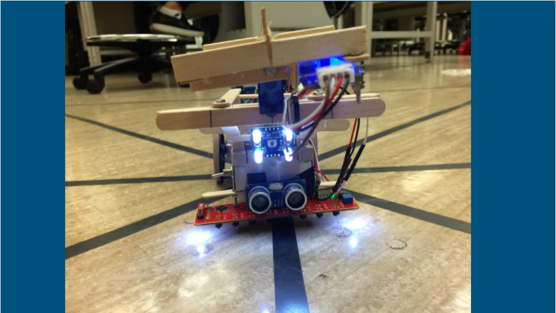
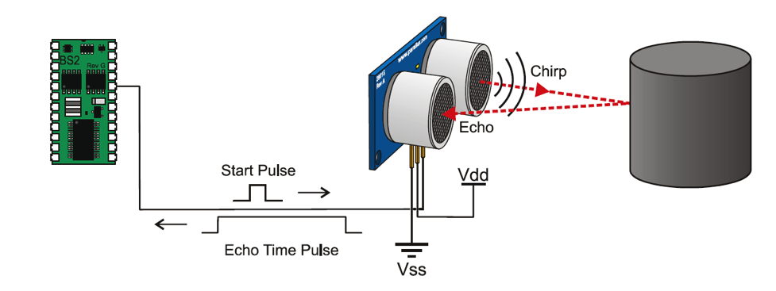

<html>
<picture>
  <source media="(prefers-color-scheme: dark)" srcset="https://user-images.githubusercontent.com/25423296/163456776-7f95b81a-f1ed-45f7-b7ab-8fa810d529fa.png">
</picture>

<head>
  <title>Dhruval Shah, BASc EIT</title>
</head>

<body>
  <h1><u>Projects</u></h1>
  <h2>The SunFinder (Line Following Robot)</h2>
  <h3>Overview</h3>

 

  
As a part of a design course, we were required to create an autonomous robot (which we named 'The SunFinder') under time and budget constraints. The objective of the robot was to navigate a pre-determined grid, marked by black tape, and dispose waste materials inside previously selected bins that were located at the edges of the grid. My primary focus was on designing and implementing the navigation and bin detection software.
  

  

     

      
     

    

      
    

    

      
      

    

  

  
  <h3>Software Implementation</h3>
 
  

  
  The software for this robot was implemented using an Arduino Uno Microcontroller and a variety of sensors; for the purpose of grid navigation and bin detection, we used SunFounder IIC IR Line Following Module and an HC-SR04 Ultrasonic Sensor (shown below from left to right
   
  

  

  

     

      
     

    

      
    

  
  
 
  

  

  
  <h1><u>Relevant Coursework:</u></h1>
<ul>
  <li>Data Structures and Algorithms (CPSC259)</li>
  <li>Microelectronic Circuits (ELEC301)</li>
  <li>Electrical Engineering Design Studio I and II (ELEC291 and ELEC391)</li>
  <li>Systems and Control (ELEC341/441)</li>
</ul>
  </body>
</html>

